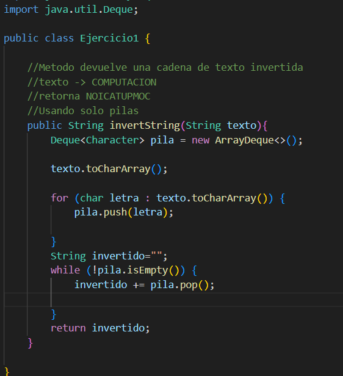
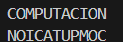
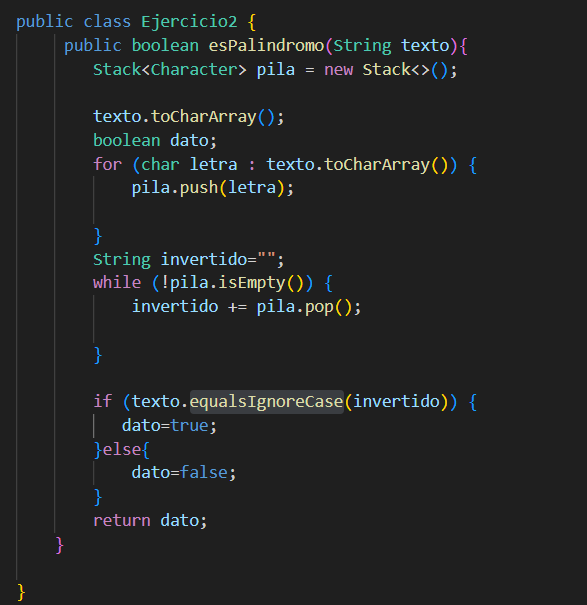
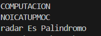

## Datos del Estudiante
- **Nombre:** Alfonso Auquilla
- **Curso:** Estructura de Datos grupo 1
- **Fecha:** 3/6/2026

---

## 1. Implementación de Caja<T> y Par<K, V>

**Fecha:** 3/6/2026
**Descripción:** En esta practica se realizo la implememtacion de listas enlasadas creando una lista de LinkedList() y utilisando sus metodos
algunos metodos generales de la lista como size() que devuelve la cantidad de elemntos, IsEmpty que ve si existen elementos en la lista.

*** Colas ***  Se implementaro cola que el priimer elemento que entra es el primero que sale, se usaron sus metodos como: offer() que agrega un 
elemento al final, .

## 2. Ejercicio Palíndromo

**Fecha:** 10/6/2026

**Descripción:**
Se uso pilaas para poder crear una pila para agregar letra por letra del texto enviado, para luego invertir la palabra con punto pop que invierte la palabra por LIFO el ultimo que entra es el primero que sale, se uso una variable donde se guardaba la palabra invertida, para luego comprara con equalsIgnoreCase para que ignore, si son iguales devulce true y si no lo son devuelve true

### Método implementado

